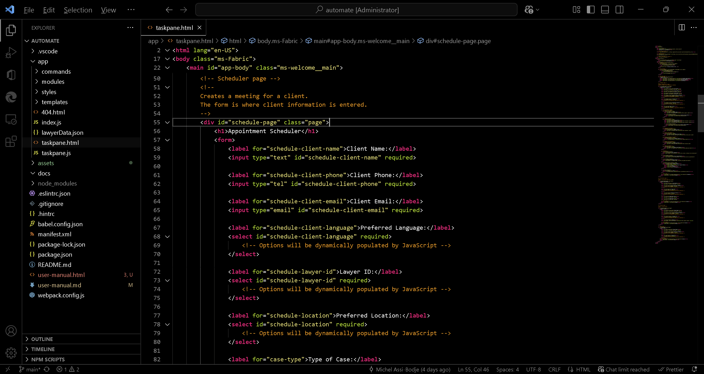
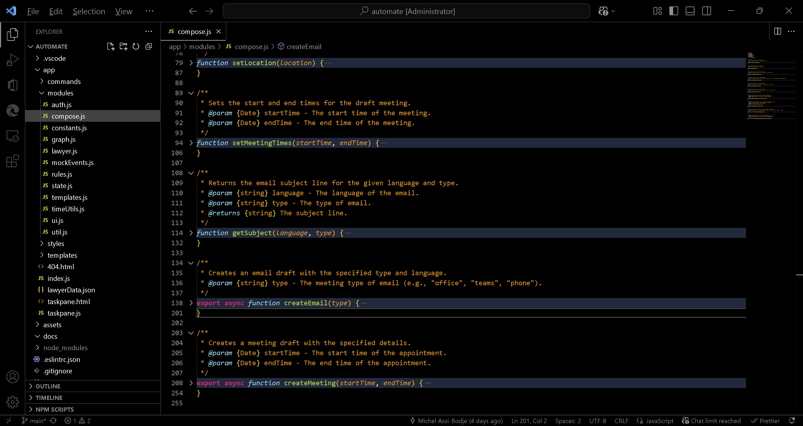
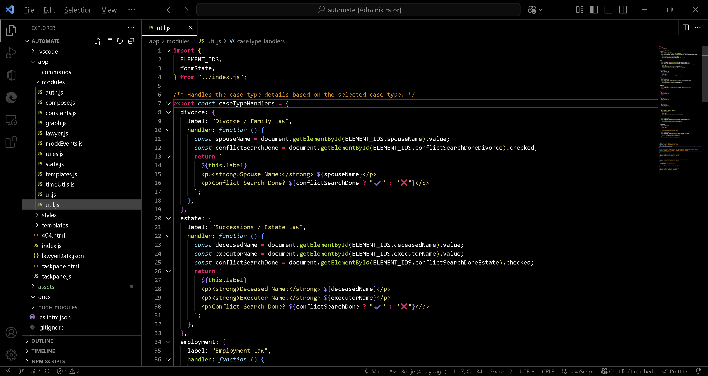

# Updated User Manual for Allen Madelin Office Add-In

  

## Overview

The Allen Madelin Office Add-In (Automate) is designed to streamline common tasks for the law firm. It integrates directly into Office (Outlook and Word), allowing users to perform these tasks efficiently without leaving their email client. The add-in dynamically adapts its menu options based on the context:

- **Draft Email Message**: Displays only email-related options.
- **Draft Appointment**: Displays only the scheduling option.
- **Word Document**: Displays only the contract-making option.

Additionally, the add-in now supports two scheduling modes: **Auto** (default) and **Manual**.

This manual is divided into two sections:
1. **User Workflow**: Instructions for using the add-in to schedule appointments and draft emails.
2. **Developer Guide**: A detailed explanation of the codebase to help future developers maintain and extend the add-in.

---

## User Workflow

### Accessing the Add-In
1. Open Outlook or Word.
2. Depending on the context, open a new **email**, **meeting**, or **Word document**.
3. Select **Automate** from the ribbon options.

 

  

 

### Context-Specific Menus

- **Email Draft**: Options include:
  - **Send Confirmation**
  - **Send Contract**
  - **Send Reply**
- **Appointment Draft**: Option includes:
  - **Schedule Appointment**
- **Word Document**: Option includes:
  - **Create Contract**

### Scheduling Appointments
1. From the main menu, click **Schedule Appointment**.

2. Choose between **Auto** (default) or **Manual** scheduling modes:
   - **Auto**: Automatically finds the next available slot based on the lawyer's calendar.
   - **Manual**: Allows you to select a specific date and time.
3. Fill out the required fields in the form:
   - **Client Name**: Enter the client's full name.
   - **Client Phone**: Provide the client's phone number.
   - **Client Email**: Enter the client's email address.
   - **Preferred Language**: Select the client's preferred language (English or French).
   - **Lawyer ID**: Choose the lawyer handling the case.
   - **Preferred Location**: Select the meeting location (Office, Phone, or Teams).
   - **Type of Case**: Choose the type of case (e.g., Divorce, Estate, Employment).
   - Additional details may be required based on the case type (e.g., spouse name for divorce cases).

4. Check any applicable boxes:
   - **Réf. Barreau**: If the client is a referral from the Barreau.
   - **First Consultation**: If this is the client's first consultation.
   - **Payment Made**: If the payment has already been made.
5. Add any **Notes** if necessary.
6. Click **Schedule** to finalize the appointment.

 

*Example appointment automation. By default, (ma) is appended to subject and payment method 😉*
 

  

 

The add-in will:
- Validate the inputs.
- Check the calendar for a suitable time.
- Fill out the draft meeting with the chosen date and time.

### Writing Draft Emails
1. From the main menu, select the type of email you want to draft:
   - **Send Confirmation**: Draft a confirmation email for an appointment.
   - **Send Contract**: Draft an email with a service contract.
   - **Send Reply**: Draft a reply to a client inquiry.

2. Fill out the required fields in the form:
   - **Client Email**: Enter the recipient's email address.
   - **Preferred Language**: Select the language for the email.
   - **Lawyer ID**: Choose the lawyer associated with the email.
   - Additional fields may appear depending on the email type (e.g., deposit amount for contracts).

3. Click **Create** to generate the draft email.

The add-in will populate the email body using predefined templates and insert the necessary details.

 

*Example confirmation email. You now also have a first consultation checkbox, which sets the appropriate rate.*
 

  

 

*Example contract email. Note that the amount + tax is automatically calculated.*
 

  

 

### Creating Contracts in Word

1. Open a Word document and select **Automate** from the ribbon.
2. Click **Create Contract**.
3. Fill out the required fields, such as client details and contract specifics.
4. Click **Generate** to create the contract.

*Word interface with add-in location*
 

  

 

---

## Developer Guide

### Codebase Overview

The add-in is built using JavaScript and integrates with the Office JavaScript API. The codebase is modular, with each module handling a specific aspect of the add-in's functionality.

The source code is hosted on Github at [https://github.com/michel-bodje/automate.git](https://github.com/michel-bodje/automate.git).

The add-in manifest files point to the Github Pages URL at [https://michel-bodje.github.io/automate](https://michel-bodje.github.io/automate), but it is not recommended to open in a browser as the app breaks outside of Office.

#### Key Files and Directories
- **`app/`**: Contains the main application logic.
  - **`taskpane.html`**: The main UI for the add-in.
  - **`taskpane.js`**: Handles user interactions and orchestrates the workflow.
  - **`modules/`**: Contains reusable modules for specific functionalities.
    - **`auth.js`**: Handles authentication with Microsoft services.
    - **`graph.js`**: Interacts with the Microsoft Graph API to fetch calendar events.
    - **`compose.js`**: Manages email drafting.
    - **`lawyer.js`**: Manages lawyer data and operations.
    - **`rules.js`**: Implements business rules for scheduling.
    - **`state.js`**: Manages the form state.
    - **`ui.js`**: Handles UI interactions and updates.
    - **`util.js`**: Contains utility functions for validation and formatting.
    - **`timeUtils.js`**: Provides time-related utilities for scheduling.
- **`assets/templates/`**: Stores email and docx templates in English and French.
- **`manifests/`**: Defines the add-in's metadata and configuration for Outlook and Word.
- **`webpack.config.js`**: Configures the build process.
- **`package.json`**: Configures the build scripts.

#### Workflow Explanation
1. **User Interaction**:
   - The user interacts with the UI in `taskpane.html`.
   - Events are handled in `taskpane.js`, which updates the `formState` object and triggers the appropriate actions.

 

*Most dropdowns are dynamically generated. Other fields only become visible conditionally.*
 

  

 

2. **Scheduling Appointments**:
   - The `scheduleAppointment` function in `taskpane.js`:
     - Validates inputs using `util.js`.
     - Fetches the lawyer's calendar events via `graph.js`.
     - Generates available time slots using `rules.js` and `timeUtils.js`.
     - Creates a meeting using `compose.js`.

3. **Drafting Emails**:
   - The `createEmail` function in `compose.js`:
     - Retrieves the appropriate email template from `templates.js`.
     - Replaces placeholders with dynamic data from `formState`.
     - Sets the email subject, body, and recipients using the Office JavaScript API.

 

*In `compose.js`, the `createEmail` and `createMeeting` functions are the basis of this add-in.*
 

  

 

4. **Authentication**:
   - The `auth.js` module initializes the MSAL library for authentication.
   - Access tokens are acquired to interact with the Microsoft Graph API.

5. **Calendar Integration**:
   - The `graph.js` module fetches and manages calendar events using the Microsoft Graph API.

6. **Business Rules**:
   - The `rules.js` module enforces rules for scheduling, such as avoiding lunch breaks and respecting daily appointment limits.

7. **Dynamic Menus**:
   - Implemented in `taskpane.js` to adapt options based on context.

8. **Scheduling Modes**:
   - Added in `taskpane.js` and `ui.js` to support Auto and Manual modes. 

#### Extending Functionality
- **Adding a New Email Template**:
  1. Create a new HTML file in the `assets/templates/` directory.
  2. Use placeholders in the same format as existing templates (e.g., `${clientName}`, `${date}`) to ensure dynamic data can be inserted.
  3. Add the template to `templates.js` under the appropriate language.
  4. Update `compose.js` to handle the new template type.
  5. Test the new template by selecting the corresponding email type in the add-in and verifying the generated draft email.

- **Adding a New Word Template**:
  1. Create a new `.docx` template file and save it in the `assets/templates/` directory.
  2. Use placeholders in the same format as existing templates (e.g., `{{clientName}}`, `{{clientEmail}}`) to ensure dynamic data can be inserted.
  3. Update `templates.js` to include the new template under the appropriate language and category.
  4. Modify `compose.js` to handle the new template type when generating Word documents.
  5. Test the new template by selecting **Create Contract** in Word and verifying the output.

- **Adding a New Case Type**:
  1. Update `lawyerData.json` to include the new case type for relevant lawyers.
  2. Add a handler for the case type in `util.js`.
  3. Update `taskpane.html` to include any additional fields required for the case type.

- **Modifying Business Rules**:
  - Update the `rules.js` module to implement new rules or modify existing ones.

 

*Lawyer representation in JSON*
 

  

 

*Editing case types*
 

  

 

#### Debugging and Testing
- Ensure that all dependencies are installed by running `npm install` before starting the server.

- To run the add-in locally, use the following npm scripts:
    1. Start the development server: `npm start`.
    This will launch both Outlook and Word for concurrent debugging.  
    2. Stop the development server: Press `Ctrl+C` in the terminal where the server is running, or use `npm stop`.

- The `webpack.config.js` file is already configured to handle differences between development and production environments. To test the production build:
    1. Run `npm run build` to generate the production files.
    2. Access the production version of the add-in via Outlook logged to [admin@amlex.ca](mailto:admin@amlex.ca).

- Test the add-in in both development and production environments to ensure compatibility.

 

  

 

---

## Conclusion

This add-in simplifies appointment scheduling, email drafting, and contract creation for Allen Madelin. The dynamic menus and scheduling modes enhance usability and efficiency.