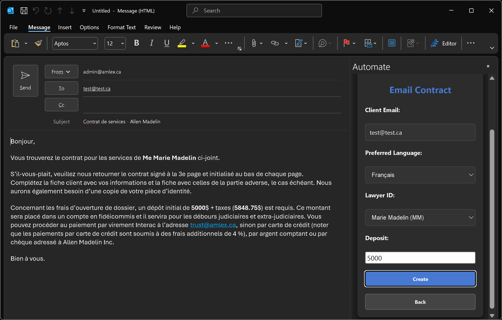

# User Manual for Allen Madelin Outlook Add-In

  

## Overview

The Allen Madelin Outlook Add-In (Automate) is designed to streamline appointment scheduling and email drafting for the law firm. It integrates directly into Outlook, allowing users to perform these tasks efficiently without leaving their email client.

This manual is divided into two sections:
1. **User Workflow**: Instructions for using the add-in to schedule appointments and draft emails.
2. **Developer Guide**: A detailed explanation of the codebase to help future developers maintain and extend the add-in.

---

## User Workflow

### Accessing the Add-In
1. Open Outlook.
2. Open a new **email** or **meeting** draft.
3. Select **Automate** from the ribbon options.

  

### Scheduling Appointments
1. From the main menu, click **Schedule Appointment**.

  

2. Fill out the required fields in the form:
   - **Client Name**: Enter the client's full name.
   - **Client Phone**: Provide the client's phone number.
   - **Client Email**: Enter the client's email address.
   - **Preferred Language**: Select the client's preferred language (English or French).
   - **Lawyer ID**: Choose the lawyer handling the case.
   - **Preferred Location**: Select the meeting location (Office, Phone, or Teams).
   - **Type of Case**: Choose the type of case (e.g., Divorce, Estate, Employment).
   - Additional details may be required based on the case type (e.g., spouse name for divorce cases).

  
  

3. Check any applicable boxes:
   - **Réf. Barreau**: If the client is a referral from the Barreau.
   - **First Consultation**: If this is the client's first consultation.
   - **Payment Made**: If the payment has already been made.
4. Add any **Notes** if necessary.
5. Click **Schedule** to finalize the appointment.

  

The add-in will:
- Validate the inputs.
- Check the calendar for a suitable time.
- Fill out the draft meeting with the chosen date and time.

### Writing Draft Emails
1. From the main menu, select the type of email you want to draft:
   - **Send Confirmation**: Draft a confirmation email for an appointment.
   - **Send Contract**: Draft an email with a service contract.
   - **Send Reply**: Draft a reply to a client inquiry.

2. Fill out the required fields in the form:
   - **Client Email**: Enter the recipient's email address.
   - **Preferred Language**: Select the language for the email.
   - **Lawyer ID**: Choose the lawyer associated with the email.
   - Additional fields may appear depending on the email type (e.g., deposit amount for contracts).

3. Click **Create** to generate the draft email.

  

*Example confirmation email*

  

*Example contract email. Note that the amount + tax is automatically calculated.*

The add-in will populate the email body using predefined templates and insert the necessary details.

---

## Developer Guide

### Codebase Overview

The add-in is built using JavaScript and integrates with the Office JavaScript API. The codebase is modular, with each module handling a specific aspect of the add-in's functionality.

#### Key Files and Directories
- **`app/`**: Contains the main application logic.
  - **`taskpane.html`**: The main UI for the add-in.
  - **`taskpane.js`**: Handles user interactions and orchestrates the workflow.
  - **`modules/`**: Contains reusable modules for specific functionalities.
    - **`auth.js`**: Handles authentication with Microsoft services.
    - **`graph.js`**: Interacts with the Microsoft Graph API to fetch calendar events.
    - **`compose.js`**: Manages email drafting.
    - **`lawyer.js`**: Manages lawyer data and operations.
    - **`rules.js`**: Implements business rules for scheduling.
    - **`state.js`**: Manages the form state.
    - **`ui.js`**: Handles UI interactions and updates.
    - **`util.js`**: Contains utility functions for validation and formatting.
    - **`timeUtils.js`**: Provides time-related utilities for scheduling.
  - **`templates/`**: Stores email templates in English and French.
- **`manifest.xml`**: Defines the add-in's metadata and configuration.
- **`webpack.config.js`**: Configures the build process.

   _**[Insert Screenshot of File Structure Here]**_

#### Workflow Explanation
1. **User Interaction**:
   - The user interacts with the UI in `taskpane.html`.
   - Events are handled in `taskpane.js`, which updates the `formState` object and triggers the appropriate actions.

   _**[Insert Screenshot of Taskpane UI Here]**_

2. **Scheduling Appointments**:
   - The `scheduleAppointment` function in `taskpane.js`:
     - Validates inputs using `util.js`.
     - Fetches the lawyer's calendar events via `graph.js`.
     - Generates available time slots using `rules.js` and `timeUtils.js`.
     - Creates a meeting using `compose.js`.

   _**[Insert Screenshot of Appointment Scheduling Workflow Here]**_

3. **Drafting Emails**:
   - The `createEmail` function in `compose.js`:
     - Retrieves the appropriate email template from `templates.js`.
     - Replaces placeholders with dynamic data from `formState`.
     - Sets the email subject, body, and recipients using the Office JavaScript API.

    _**[Insert Screenshot of Email Drafting Workflow Here]**_

   4. **Authentication**:
   - The `auth.js` module initializes the MSAL library for authentication.
   - Access tokens are acquired to interact with the Microsoft Graph API.

5. **Calendar Integration**:
   - The `graph.js` module fetches and manages calendar events using the Microsoft Graph API.

6. **Business Rules**:
   - The `rules.js` module enforces rules for scheduling, such as avoiding lunch breaks and respecting daily appointment limits.

#### Extending Functionality
- **Adding a New Email Template**:
  1. Create a new HTML file in the `templates/` directory.
  2. Add the template to `templates.js` under the appropriate language.
  3. Update `compose.js` to handle the new template type.

- **Adding a New Case Type**:
  1. Update `lawyerData.json` to include the new case type for relevant lawyers.
  2. Add a handler for the case type in `util.js`.
  3. Update `taskpane.html` to include any additional fields required for the case type.

   _**[Insert Screenshot of case type handlers Here]**_

- **Modifying Business Rules**:
  - Update the `rules.js` module to implement new rules or modify existing ones.

#### Debugging and Testing
- Use the `Dev Server` task in `tasks.json` to run the add-in locally.
- Use the `Lint` tasks to check for code quality issues.
- Test the add-in in both development and production environments to ensure compatibility.

_**[Insert Screenshot of npm start Here]**_

---

## Conclusion

This add-in simplifies appointment scheduling and email drafting for Allen Madelin. The modular codebase ensures maintainability and extensibility, allowing future developers to adapt the add-in to evolving business needs.